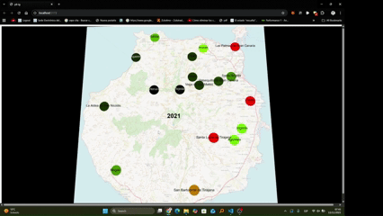

# Práctica 8 – Visualización de Datos Geográficos

En esta práctica se ha realizado una visualización de la evolución de la población en los distintos municipios de la isla de **Gran Canaria**, utilizando técnicas de representación geográfica sobre un mapa basado en datos abiertos.

## Descripción del proceso

1. **Obtención del mapa**  
   Se descargó la textura de la isla desde *OpenStreetMap* como imagen.

2. **Representación del mapa**  
   La imagen se aplicó como textura sobre un plano en la escena 3D.

3. **Conversión de coordenadas**  
   A partir de la latitud y longitud mínima y máxima del mapa, junto con las dimensiones en píxeles, se implementó una conversión de coordenadas geográficas (lat/lon) a coordenadas en el plano para posicionar cada municipio.

4. **Obtención de los datos**  
   Se extrajeron desde el **ISTAC** los datos de población por municipio para todos los años comprendidos entre **1996 y 2024**.

5. **Representación por color**  
   Cada municipio se visualiza mediante un punto cuyo color depende de su población.  
   La escala va desde **verde muy oscuro (poblaciones bajas)** hasta **rojo intenso (poblaciones altas)**, siguiendo una gradación continua.

---

## Demostración

El vídeo completo de la visualización se encuentra dentro de la carpeta **`/public`**.
